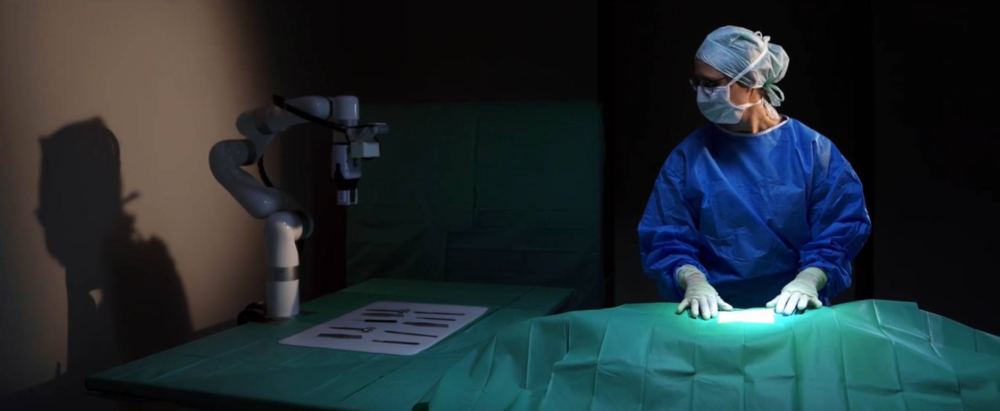
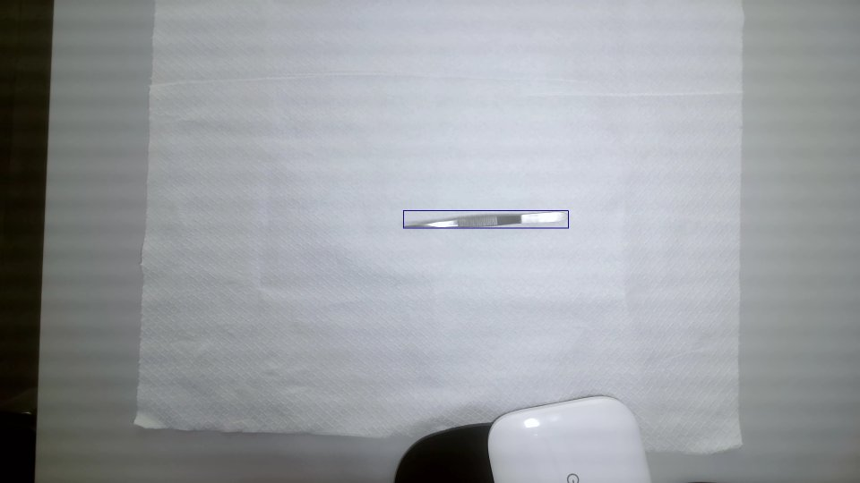
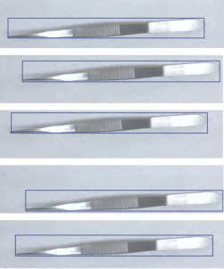
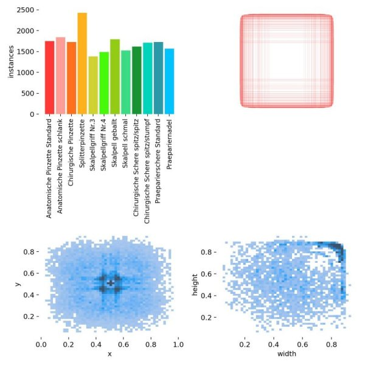
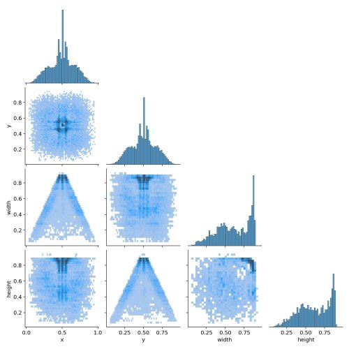
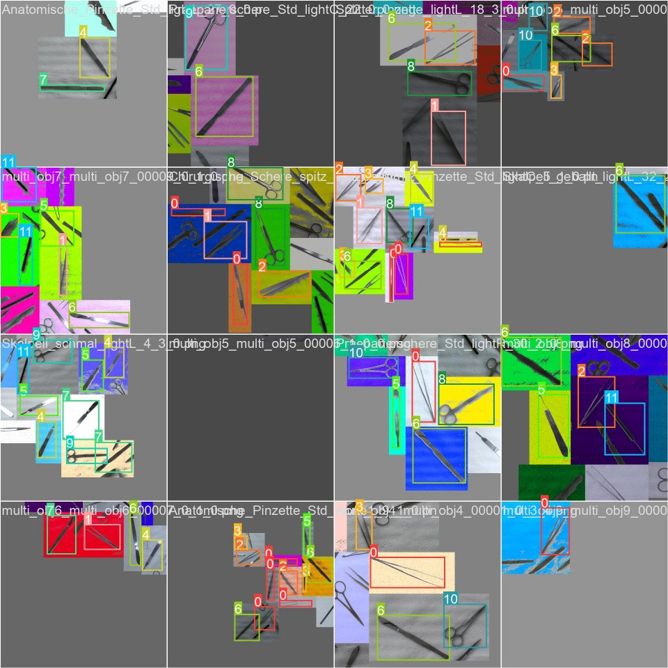
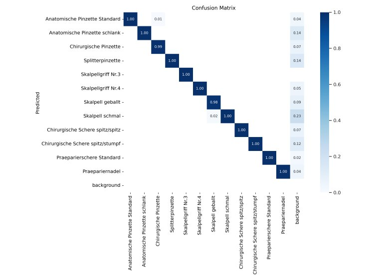
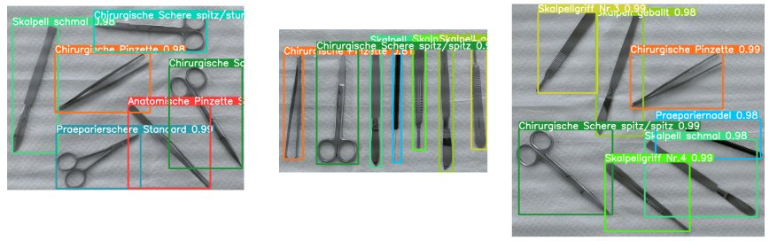

# Surgical instrument detector
The surgical instrument detector project allows you to train a YOLO5 model to detect surgical instruments using the Rona ataset.

This repository can be used in a [Rona](https://gitlab.intranet.doccheck.ag/rd/Robot-xArm-Development) setup.  


# Meet Rona - your Open Source assistant for surgical procedures
Rona is an upgrade kit for robotic arms designed to address the problem with declining numbers of nurses in hospitals in
Germany, but also around the world. Rona's development is dedicated to create an affordable, easy to use, one-of-a-kind
software upgrade for surgery procedures and interventions where an additional hand is required, but a human support
might not be available.

The main GitHub repository for the Rona project: https://gitlab.intranet.doccheck.ag/rd/Robot-xArm-Development \
For further information visit also: https://more.doccheck.com/en/rona/ 
[](https://more.doccheck.com/en/rona/)


## Getting started

The first step is to clone the Yolov5 from the official GitHub repository. 
```
git clone https://github.com/ultralytics/yolov5
```
Then run the bash script to apply all our changes to the Yolov5 repository. 
``` 
sh script.sh
```

## Docker setup
We have created a Dockerfile to train/run the model in a container. 
``` 
cd yolov5
make build
```

## Data collection
We have captured frames from different surgical tools to train our custom model.

Please note that capturing the frames/videos needs a camera to be installed and connected on the corresponding machine. 

Run the following commands to install the required packages and create a virtual environment.
``` 
sudo apt install python3-virtualenv
virtualenv yolov5_venv
source yolov5_env/bin/activate
sudo pip3 install -r requirements_cam_virtenv.txt
```
Capturing frames from the camera and saving them. Camera port and resolution can be changed according to the camera settings.
``` 
(yolov5_venv) python3 -m  preprocessing.main --cam-port 0 --cam-res 1920 1080 --output-path data/dataset/captured_samples/ --obj-name sample_frame camera-capture-frames
```
Capturing video from the camera and saving them. Camera port and resolution can be changed according to the camera settings.
``` 
(yolov5_venv) python3 -m  preprocessing.main --cam-port 0 --cam-res 1920 1080 --output-path data/dataset/captured_samples/ --video-name sample_video.avi --fps 5 camera-capture-video
```
Deactivating the virtual environment.
``` 
(yolov5_venv) deactivate
```
Frames and videos can be converted to each other using the following command inside the docker container.
You can change the input/output paths and other settings inside the MakeFile.
```
# generate video from frames
make convert-frames-video
# generate frames from video
make convert-video-frames
```
## Data annotation
You can annotate the collected dataset using any annotation tool which generates Yolo standard bounding box annotations.

Rona training dataset is annotated using [Yolo_Mark](https://github.com/AlexeyAB/Yolo_mark) tool.

After annotating the frames, structure the dataset(frames and annotations) as follows:
```
├── obj1
│   ├── obj1_01.png
│   ├── obj1_02.png
│   ├── ...
├── annot_obj1
│   ├── obj1_01.txt
│   ├── obj1_02.txt
│   ├── ...
├── obj2
│   ├── obj2_01.png
│   ├── obj2_02.png
│   ├── ...
├── annot_obj2
│   ├── obj1_01.txt
│   ├── obj2_02.txt
│   ├── ...
├── ...
```

# Preprocessing
Preprocessing pipeline is based on extracting and generating the dataset from the raw captured and annotated frames.  
The extraction process is accordant with random positioning of the bounding boxes. For each object in a frame, 5 different samples are generated where the object's bounding box is fitted to the edges of the sample(left, right, top, bottom, center) with some optional padding.

If a frame consists more than one object, each pair of objects are combined to form a larger bounding box (contour) and the process is repeated for each pair separately.

|  |  |
|---------------------------------------------------------------------------------------|-------------------------------------------------------------------------------------------|
| Raw frame                                                                             | Extracted samples                                                                         |

Then the generated samples are split into the train, validate and test sets.

### custom dataset
To generate the dataset, you can run the following command inside the docker container with default settings.
``` 
make data-preparation
```
or alternatively,
``` 
python3 -m  preprocessing.run --input-data-path data/dataset/Custom_dataset/ --output-data-path data/dataset/Custom_dataset_final_fit/ --bb-size 640 --padding 50 --train-val-test 0.9 0.1 0.0  --seed 42
```

### Rona dataset
Our raw dataset consists of two different types frames including only one single surgical tool and multiple surgical tools per frame.
In our experiments, we have trained the model with both single and multi-tool frames which results in better detection rate.

We published our Rona dataset on the [Huggingface](https://huggingface.co/DocCheck) platform.


[Raw dataset with annotations](https://huggingface.co/DocCheck/medical-instrument-detection) 

[Preprocessed dataset with annotations](https://huggingface.co/DocCheck/medical-instrument-detection) (training set)

[Rona test dataset](https://huggingface.co/DocCheck/medical-instrument-detection) (testing set)

|  |  |
|---------------------------------------------------------------------------------------|---------------------------------------------------------------------------------------------------------------------------|
| labels                                                                                | labels correlogram                                                                                                        |


# Data augmentation
We have altered the data augmentation methods in the Yolov5 repository. 
We trained the model with the "mosaic9" augmentation method. To increase the detection rate, we synthesised the dataset with color and brightness perturbation following up with the random statistical background smoothing and applying S&P noise filter.
The configuration file for the augmentation methods can be found in the `rona.hyp.scratch.yaml` file.
Here is an illustration of the generated augmented sample batch to train the model with (iou_t = 0.2). 

|  |
|--------------------------------------------------------------------------------------------|
| Augmented training batch                                                                   |


# Train
We published our trained model on the [Huggingface](https://huggingface.co/DocCheck) platform.

[Rona surgical instrument detection model](https://huggingface.co/DocCheck/medical-instrument-detection) 

To train the model, you can run the following command inside the docker container with default settings.
``` 
make train-image
```
or alternatively,
``` 
python3 -m  train --data data/dataset/Rona_dataset_final_single_multi_fit/data.yaml --weights yolov5l.pt --hyp rona.hyp.scratch.yaml --img 960 --epochs 200 --batch-size 16 --workers 0 --name Rona_detector_model --seed 42
```

|  |
|-----------------------------------------------------------------------------------------------|
| Confusion Matrix on the validation set                                                        |


# Inference
To test the model on our Rona Test or any custom dataset, you can run the following command inside the docker container with default settings.
``` 
make predict-image
```
or alternatively,
``` 
python3 -m  detect --weights runs/train/Rona_detector_model/weights/best.pt  --source 'data/dataset/Rona_dataset_test/images/*.png' --img 960 --conf-thres 0.80 --iou-thres 0.6 --agnostic-nms
```

|  |
|------------------------------------------------------------------------------------------|
| Inference on the Rona test set                                                           |


# How To Get Involved
Do you want to support the development? We are always looking for new contributors and feedback.
### Bugs and issues
If you found an issue or have a feature request, please open an issue on the [issue tracker](https://github.com/DocCheck/Surgical-Instrument-Detector/)

### Code contribution
If you want to contribute to the code by implementing new features, feel free to contribute to this project.